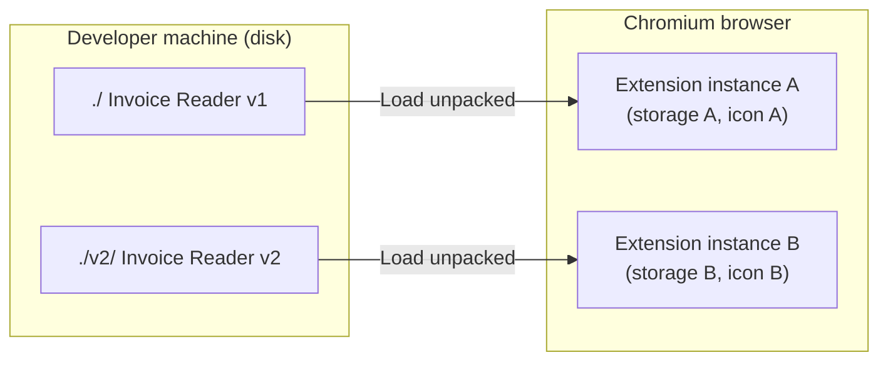
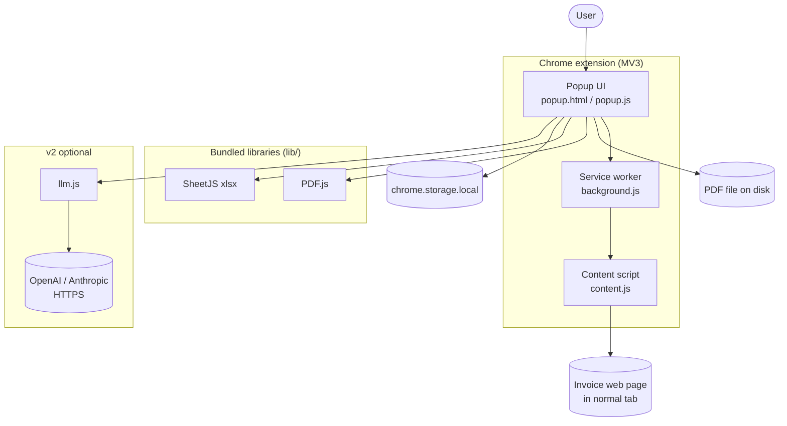
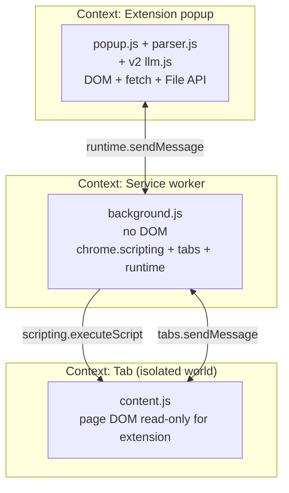
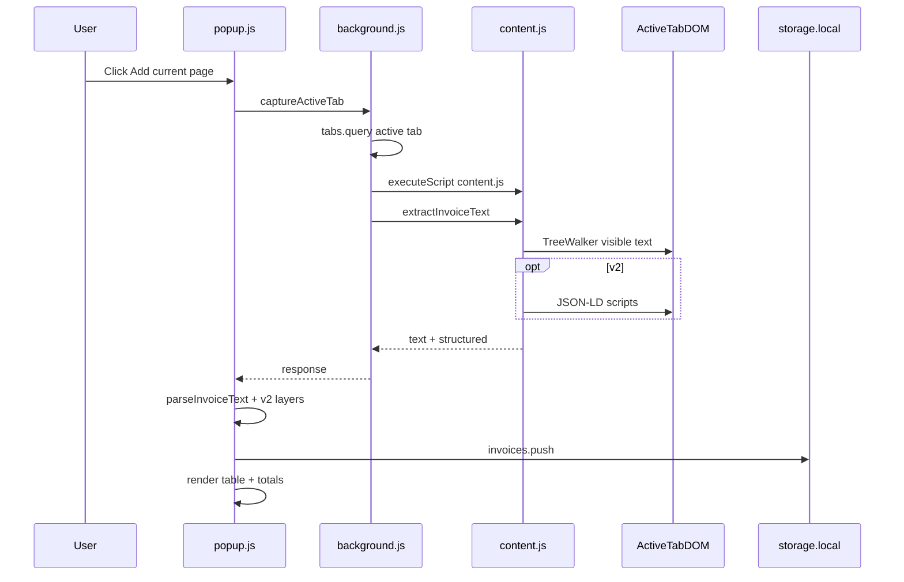
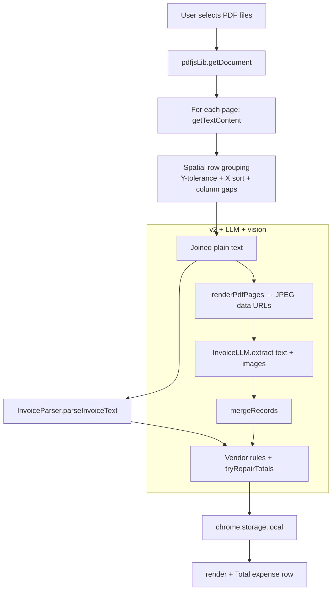
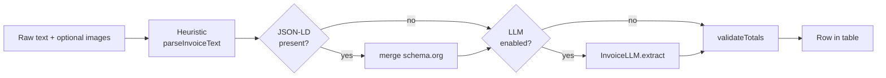
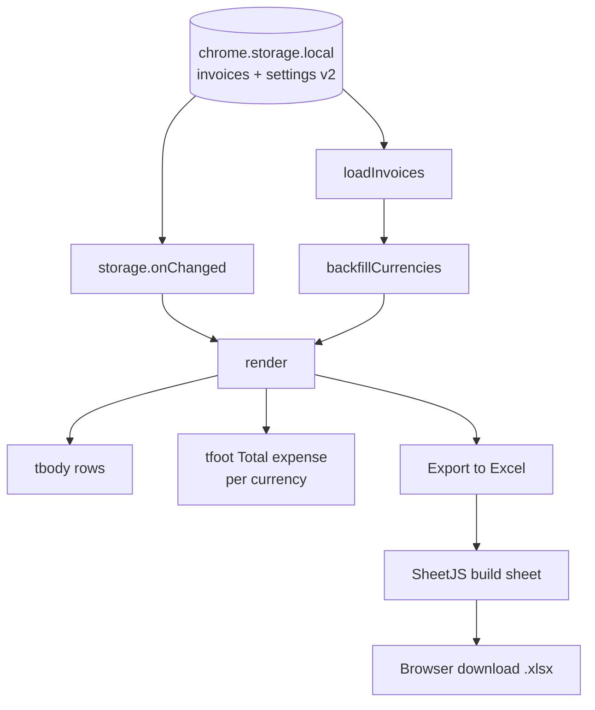
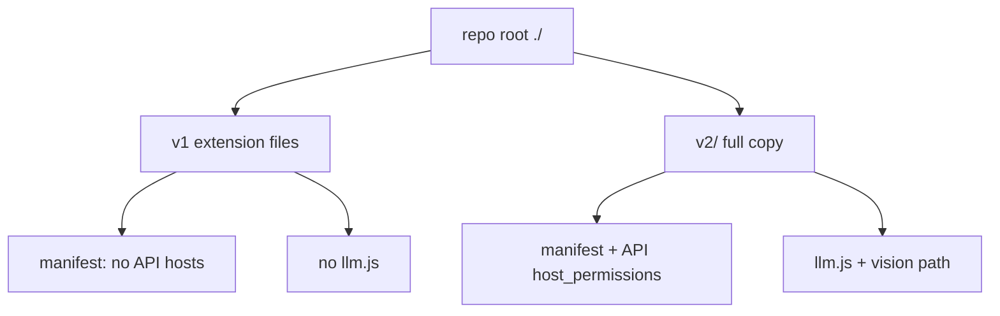
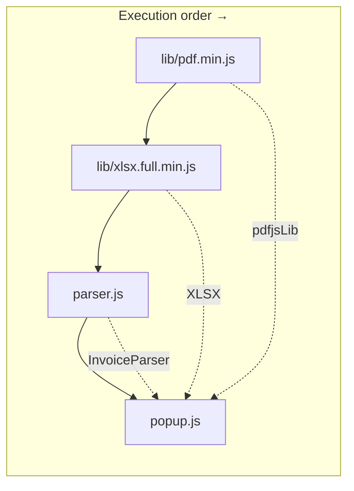

# Invoice Reader — workspace

This folder contains **two independent unpacked Chrome extensions** you can load side-by-side:

| Folder | Extension name | What it does |
| ------ | -------------- | ------------ |
| `./` (this folder) | **Invoice Reader** | v1 — heuristic regex + label parser only; fully offline; blue icon. |
| `./v2/` | **Invoice Reader v2** | v2 — adds AI-assisted extraction (OpenAI / Anthropic), schema.org JSON-LD, spatial PDF parsing, vision for PDFs, cross-field validation, inline edits, multi-currency totals; indigo icon with green **2** badge. |

Chrome treats each directory as a separate extension (separate storage, icons, settings). See [Loading both at once](#loading-both-at-once) below.

For day-to-day **use** and **LLM API setup**, see also [`v2/README.md`](./v2/README.md).

---

## Table of contents

1. [Loading both at once](#loading-both-at-once)
2. [Which version to use](#which-version-to-use)
3. [v1 — quick reference](#v1--invoice-reader-quick-reference)
4. [v2 — pointer](#v2--invoice-reader-v2)
5. [Technical architecture](#technical-architecture)
   - [Overview](#1-overview)
   - [Schematic architecture (diagrams)](#schematic-architecture-diagrams)
   - [Languages & runtime](#2-languages--runtime-stack)
   - [MV3 contexts](#3-manifest-v3-architecture-three-contexts)
   - [File layout](#4-file--module-inventory)
   - [End-to-end flows](#5-end-to-end-flows)
   - [Extraction pipeline](#6-the-extraction-pipeline)
   - [Persistence](#7-persistence-layer)
   - [UI](#8-ui-architecture)
   - [Excel export](#9-excel-export)
   - [Security & privacy](#10-security--privacy)
   - [Third-party libraries](#11-third-party-libraries)
   - [External APIs v2](#12-external-apis-v2-only)
   - [Dev tooling](#13-build--dev-tooling)
   - [v1 vs v2](#14-v1-vs-v2-summary)
   - [Extension points](#15-where-to-extend)

---

## Loading both at once

1. Open `chrome://extensions` (or `edge://extensions`, `brave://extensions`).
2. Enable **Developer mode** (top-right).
3. **Load unpacked** → select **this folder** (v1). It appears as “Invoice Reader” with the blue icon.
4. **Load unpacked** again → select **`v2/`**. It appears as “Invoice Reader v2” with the indigo icon.
5. Pin both toolbar icons if you want quick access.

## Which version to use?

- **v1** — No network, no setup; regex/heuristics only. Good for standard layouts; long tail is harder.
- **v2** — Best accuracy with an LLM API key. Without a key, v2 still uses the same heuristic core plus JSON-LD when pages expose it.

**Storage is not shared** between v1 and v2.

## v1 — Invoice Reader (quick reference)

### Features

- Capture active tab or upload text-based PDFs.
- Heuristic fields: vendor, invoice number, date, currency, subtotal, tax, total (multi-locale).
- Table in popup, persistent via `chrome.storage.local`.
- Excel export (SheetJS).
- Running **Total expense** row (per-currency sums).
- Fully offline in v1.

### File layout (repo root)

```
./
├── manifest.json
├── background.js      Service worker
├── content.js         Visible-text scraper
├── parser.js          Heuristic parser + repair + vendor rules
├── popup.html         Popup markup
├── popup.css          Styling (light + dark)
├── popup.js           UI, PDF, totals, export
├── icons/
├── lib/               pdf.js + SheetJS
└── v2/                Full v2 copy + v2/README.md
```

### Limitations

- Text-based PDFs only (no OCR).
- Top frame only; cross-origin iframes need their own tab.
- `chrome://` and similar internal URLs cannot be scraped.

## v2 — Invoice Reader v2

User-facing docs (API keys, vision toggle, troubleshooting): [`v2/README.md`](./v2/README.md).

---

# Technical architecture

## 1. Overview

**Invoice Reader** is a **Manifest V3** Chrome extension that:

1. Captures invoice content from **HTML** (active tab DOM) or **PDF** (user upload).
2. Normalizes text and parses **structured fields** (vendor, invoice #, date, currency, subtotal, tax, total).
3. Persists rows in **`chrome.storage.local`**.
4. Renders a **popup UI** with a scrollable table, per-row delete, **Total expense** (summed by currency), and optional inline edits (v2).
5. Exports **`Invoices`** sheet(s) as **`.xlsx`** via SheetJS.

**v1** is heuristic-only and stays on-device. **v2** optionally calls **OpenAI** or **Anthropic** (with optional **vision** images for PDFs), merges with heuristics, and can validate rows arithmetically.

## Schematic architecture (diagrams)


**Figures:** **A** workspace (two extensions) · **B** system context · **C** MV3 three contexts · **D** sequence: add current page · **E** PDF → text → record · **F** v2 extraction layering · **G** storage, UI, export · **H** repo v1 vs v2 · **I** popup script load order

### A. Workspace: two unpacked extensions



**ASCII:** Two folders on disk → two separate “Load unpacked” entries → two extension IDs, two `chrome.storage.local` namespaces, two toolbar icons.

### B. High-level system context



**ASCII:**

```
User → Popup → [background] ⇄ [content script] → page DOM
          ↓
     PDF.js / file picker ← PDF
          ↓
     parser.js (+ v2: llm.js → HTTPS)
          ↓
     chrome.storage.local ← → table UI → SheetJS → .xlsx download
```

### C. Chrome MV3: three isolated JavaScript contexts



**ASCII:** Popup ↔ Background ↔ Content script; each has its own global scope; only messages pass data.

### D. Sequence: “Add current page” (HTML invoice)



### E. Flow: PDF upload → text → record



**Note:** In v2, PDF text extraction and (when enabled) page rasterization run from the **same** `getDocument` handle; merged LLM output is combined with the heuristic record before persistence. v1 follows only the top path through `F → G`.

### F. v2 extraction layering (data flow)



**Note:** `tryRepairTotals` and vendor rules run inside / after `parseInvoiceText` depending on version; the diagram shows only the **merge order** for structured data and LLM on top of the heuristic baseline.

### G. Popup UI, storage, and export



### H. v1 vs v2 packaging (repository)



### I. Popup script load order and dependencies

`popup.html` loads scripts **bottom-up** (order matters: each file attaches to `globalThis` / `self`).

**v1**



**v2** — same chain with **`llm.js`** inserted before `popup.js`:

```text
pdf.min.js → xlsx.full.min.js → parser.js → llm.js → popup.js
```

**ASCII (v1):** PDF.js global → SheetJS global → `InvoiceParser` → UI logic uses both.

---

## 2. Languages & runtime stack

| Layer | Technology | Notes |
| ----- | ---------- | ----- |
| Manifest | JSON (MV3) | Required by Chromium. |
| Logic | **JavaScript (ES2020+)** | No TypeScript, no bundler; classic scripts. |
| Markup | **HTML5** | Single `popup.html` (extension popup window). |
| Styles | **CSS3** | Custom properties, `prefers-color-scheme: dark`, no preprocessor. |
| Async | **`async`/`await`, Promises** | Storage, messaging, PDF, `fetch` (v2). |
| Engine | **V8** inside Chromium | Runs in **three** extension contexts (below). |
| Packaging | Unpacked directory | Loaded via “Load unpacked”. |
| Dev helpers | Python (icons), Node (`node --check`), curl (vendoring libs) | Not shipped to end users. |

**Not used:** React/Vue, Webpack/Vite, `npm`/`package.json` in the shipped tree (vendor JS lives under `lib/`).

---

## 3. Manifest V3 architecture (three contexts)

| Context | Primary file(s) | Lifetime | Role |
| ------- | --------------- | -------- | ---- |
| **Service worker** | `background.js` | Event-driven; can sleep | Injects `content.js`, bridges popup ↔ tab via messages. |
| **Popup** | `popup.html`, `popup.css`, `popup.js`, `parser.js`, (+ `llm.js` in v2) | While popup open | DOM UI, PDF.js + SheetJS, storage, optional LLM `fetch`. |
| **Content script** | `content.js` | Per tab, after injection | Reads DOM (isolated world); v2 adds JSON-LD scan. |

**Communication:** `chrome.runtime.sendMessage`, `chrome.tabs.sendMessage` — no shared JS globals between contexts.

**Permissions (typical):** `storage`, `activeTab`, `scripting`; `host_permissions` include `<all_urls>` for on-demand injection; v2 adds `https://api.openai.com/*` and `https://api.anthropic.com/*`.

---

## 4. File & module inventory

**v1 (`./`):** `manifest.json`, `background.js`, `content.js`, `parser.js`, `popup.html`, `popup.css`, `popup.js`, `icons/*`, `lib/{pdf.min.js, pdf.worker.min.js, xlsx.full.min.js}`.

**v2 (`./v2/`):** Same core files plus **`llm.js`** (OpenAI + Anthropic); richer `content.js`, `parser.js` (merge/validate helpers), `popup.*` (settings, AI chip, inline edit, vision path). Duplicate `lib/` and `icons/`.

---

## 5. End-to-end flows

### 5.1 Add current page (HTML)

1. Popup sends `captureActiveTab` to `background.js`.
2. Background queries active tab, runs `chrome.scripting.executeScript({ files: ["content.js"] })`.
3. Background sends `extractInvoiceText` to the tab; content script returns visible text (+ v2: structured JSON-LD if found).
4. Popup runs `InvoiceParser.parseInvoiceText` (and v2 layers: JSON-LD merge → LLM merge if configured → `validateTotals` / `tryRepairTotals`).
5. Row appended to `chrome.storage.local`; UI re-renders.

### 5.2 Upload PDF

1. `File` → `ArrayBuffer` → **PDF.js** `getDocument` → per page `getTextContent`.
2. **Spatial reconstruction:** group glyphs by Y (row), sort by X, insert gaps for column breaks (critical for GST tables).
3. v2 with LLM + vision: rasterize first N pages to JPEG **data URLs** via `canvas`; send text + images to LLM.
4. Parse → persist → render.

### 5.3 Export Excel

1. Load all invoices from storage.
2. Build 2D array; **SheetJS** `aoa_to_sheet` → numeric formatting on money columns → `writeFile` download.

---

## 6. The extraction pipeline

### 6.1 Heuristic core (`parser.js`)

- **Normalize** whitespace / soft hyphens / NBSP.
- **Vendor:** labeled fields + scored header lines (reject parens-only, addresses, titles); **vendor rules** (e.g. MakeMyTrip) override counterparty names.
- **Invoice #:** invoice/bill/booking/confirmation patterns + travel (PNR, e-ticket).
- **Date:** flexible `DATE_RE` + labeled fallbacks.
- **Currency:** `extractCurrency` on full document (`Amount In INR`, `INR`/`Rs`/`₹`, EUR, USD, etc.) — stored on each record for totals grouping.
- **Money:** `MONEY_RE` supports US/EU/Indian groupings; **no** space as thousands separator (avoids gluing adjacent numbers).
- **Total:** **sentence** labels (`You have paid` → **first** money on line) vs **tabular** labels (`Grand Total` → **last** money on line).
- **Tax:** direct labels + **CGST+SGST+IGST** sum when split.
- **`tryRepairTotals`:** if sub+tax ≠ total, search money tokens + pairwise sums (split tax) under tight tolerance and realistic implied tax rate.

### 6.2 JSON-LD (v2, `content.js`)

Scrape `<script type="application/ld+json">`, find `Invoice`/`Order`/`Receipt` types, score candidates, map to canonical fields.

### 6.3 LLM (v2, `llm.js`)

- **OpenAI:** `chat/completions` with **`response_format: json_schema`** (strict).
- **Anthropic:** `messages` + **forced tool use** for same schema; browser header `anthropic-dangerous-direct-browser-access`.
- Optional **vision:** OpenAI `image_url` parts; Anthropic base64 `image` blocks.
- **`mergeRecords`:** non-empty LLM fields overlay heuristic baseline; **fieldSources** tracks provenance.

### 6.4 Why LLM layering helps

v2 does **not** replace the heuristic parser. It **layers** on top so you get both **speed / offline safety** and **semantic accuracy** when an API is configured.

| Layer | Role | Limits |
| ----- | ---- | ------ |
| **Heuristics** (`parser.js`) | Regex, labels, spatial PDF text, vendor rules, `tryRepairTotals` | Brittle on ambiguous tables, odd wording, issuer vs counterparty confusion |
| **JSON-LD** (optional, page HTML) | Structured `Invoice`/`Order` data when the site publishes it | Rare on many PDFs / some portals |
| **LLM** (`llm.js`) | Reads messy text like a human: correct column for “total”, PNR vs invoice #, travel phrases (`You have paid…`), GST layouts | Costs tokens; needs network + API key |

**Merge policy (`mergeRecords`):** the LLM returns a strict JSON object. For each field, **if the LLM outputs a non-empty value, it overwrites** the heuristic (or JSON-LD) value; **if the LLM leaves a field empty or null, the baseline is kept**. So:

- Turning AI off or a failed API call **never deletes** heuristic results — you still get a row.
- When the LLM is right, it **fixes** cells the rules got wrong.
- **Vision** (optional PDF page images) helps where **flattened text loses columns**; the model sees the rendered table.

**Order in `extractRecord`:** heuristic baseline → JSON-LD merge (if any) → LLM merge (if configured) → `validateTotals`. User edits in the table still override persisted fields. Flow diagram: [§ Schematic F](#f-v2-extraction-layering-data-flow).

### 6.5 Popup totals row (`popup.js`)

- Sums **parseable** `total` per **resolved currency**: `record.currency` → symbols/codes in `total` string → `extractCurrency(rawTextPreview)` for legacy rows.
- **`backfillCurrencies`** on load fills missing `currency` on old records.

---

## 7. Persistence layer

- **Key `invoices`:** array of records (`id`, `source`, `sourceType`, `capturedAt`, fields, `rawTextPreview`, optional v2: `fieldSources`, `extractedBy`, `validation`, `notes`, `vendorRule`, `llmError`, `currency`).
- **Key `settings` (v2):** `{ llm: { provider, apiKey, model, visionForPdfs } }`.
- **`chrome.storage.onChanged`** keeps the popup table in sync if storage updates elsewhere.

---

## 8. UI architecture

- **Popup:** static HTML shell; **`render(invoices)`** rebuilds `<tbody>`; **`<tfoot>`** shows **Total expense** (sticky).
- **CSS:** design tokens, dark mode, table polish, v2 settings sheet + editable cells + warning styles.
- **v2:** `contenteditable` cells blur-to-save with re-validation.

---

## 9. Excel export

- Global **`XLSX`** (SheetJS community build).
- **v1** columns: Source, Source Type, Captured At, Vendor, Invoice #, Date, Subtotal, Tax, Total.
- **v2** adds: Currency, Extracted By, Notes (when present).

---

## 10. Security & privacy

- **v1:** No outbound network for extraction.
- **v2 LLM:** User API key in `storage.local`; HTTPS only to declared hosts; invoice text/images sent only when user adds invoices and LLM is enabled.
- Content script in **isolated** world; user data bound with `textContent` where appropriate to avoid HTML injection from documents.
- Internal browser URLs blocked in `background.js` for capture.

---

## 11. Third-party libraries

| Library | Role |
| ------- | ---- |
| **PDF.js** (Mozilla) | Parse PDFs; extract positioned text; render pages to canvas (v2 vision). Worker path via `web_accessible_resources`. |
| **SheetJS (xlsx)** | Build and download `.xlsx` in the popup. |

Both are **vendored** under `lib/` (and `v2/lib/`).

---

## 12. External APIs (v2 only)

| Provider | Endpoint | Purpose |
| -------- | -------- | ------- |
| OpenAI | `POST https://api.openai.com/v1/chat/completions` | Structured JSON extraction; optional images. |
| Anthropic | `POST https://api.anthropic.com/v1/messages` | Same via tool use; optional images. |

---

## 13. Build & dev tooling

- **No build step:** edit JS → reload extension on `chrome://extensions`.
- **Optional:** `node --check *.js`, JSON-validate `manifest.json`, scripted smoke tests against `parser.js`.

---

## 14. v1 vs v2 summary

| Aspect | v1 | v2 |
| ------ | -- | -- |
| Network | None (heuristic) | Optional LLM HTTPS calls |
| Parser API surface | `normalizeText`, `parseInvoiceText`, `parseMoneyToNumber`, `extractCurrency` | Same + `confidenceScore`, `validateTotals`, `mergeRecords` |
| PDF | Spatial text | + Page images for vision when enabled |
| UI | Table, export, totals | + Settings, AI chip, inline edit, validation UI |

---

## 15. Where to extend

| Goal | Likely touchpoints |
| ---- | ------------------ |
| New booking vendor rule | `VENDOR_RULES` in `parser.js` / `v2/parser.js` |
| OCR for scans | New lib + post-PDF step when text is empty |
| Another LLM provider | `llm.js` + settings UI |
| Export “Total expense” row | `popup.js` export + SheetJS footer row |
| TypeScript | Would introduce a bundler / build pipeline — largest structural change |

---

*Last updated: schematic Mermaid diagrams (workspace, system context, MV3 contexts, HTML sequence, PDF flow, v2 layering, UI/storage/export, v1/v2 packaging, script load order) plus ASCII fallbacks.*
